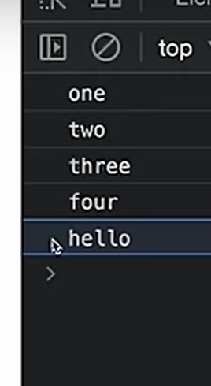
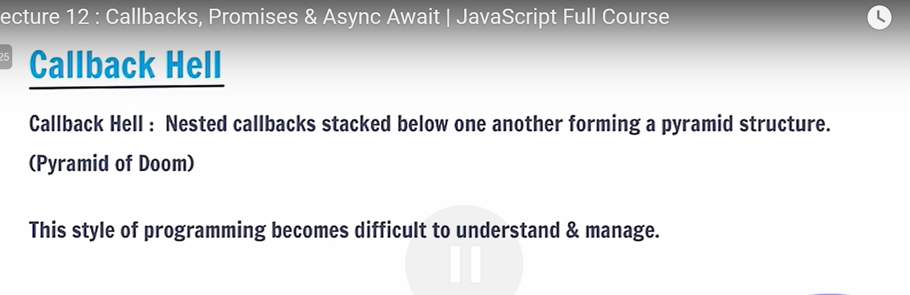
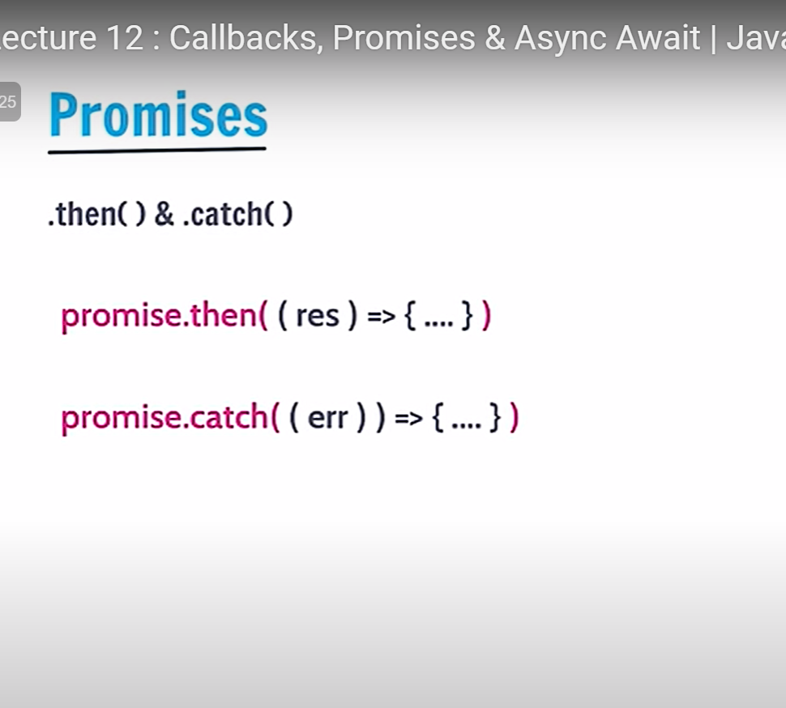

Here's a summary of the important points about APIs (Application Programming Interfaces) from the explanation:

1. **Definition of API** :

* An API is a set of rules that allows different software systems to communicate with each other.
* It defines the types of requests that can be made, how to make them, the data formats to use, and conventions to follow.

1. **Communication Between Systems** :

* APIs enable different applications, written in various programming languages, to interact seamlessly. For example, a backend in Python can communicate with a frontend in JavaScript via an API.

1. **Protocol and Data Structure** :

* APIs provide a standard protocol for communication, specifying how data should be structured and exchanged between systems.
* This standardization ensures that different systems can understand and use the data correctly.

1. **Examples of API Usage** :

* Login systems like "Login with Google" or "Login with Facebook" use APIs to authenticate users.
* Weather applications receive data from third-party APIs instead of setting up their own satellites.

1. **Benefits of APIs** :

* **Interoperability** : Different systems and applications can work together, even if they are built using different technologies.
* **Efficiency** : APIs allow developers to use existing functionalities (like user authentication or weather data) instead of building them from scratch.
* **Abstraction** : APIs hide the complexity of operations, providing a simplified interface for developers.

1. **Real-World Analogy** :

* APIs are compared to restaurant services like Zomato or Swiggy, where you order food without worrying about how it’s prepared. Similarly, APIs let you request data or services without needing to understand the underlying processes.

This explanation provides a foundational understanding of APIs, their purpose, and their practical applications in software development.

---

the most famous API used by all is the API of github. API is object with key-value pairs

another API example:

json formatter:

---

fetch is new ...uske pehle xml http request was used to fetch API

---

---

Video 40:

js me classes nam ka concept thora kam hota ha

While modern developers use `fetch`, older methods like `XMLHttpRequest` (XHR) are still relevant.

### 4.  **Legacy Methods - XMLHttpRequest (XHR)** :

* **XMLHttpRequest (XHR)** : A legacy method for making HTTP requests.
* **Usage** : Though older, it's still powerful and used in some frameworks.
* **Event-Driven** : XHR relies on events like `readyStateChange` to handle the state of the request.

### 5.  **Understanding Ready States** :

* **Ready States** : XHR provides different states that indicate the progress of an HTTP request.
* **0 (UNSENT)** : Client has been created but the request has not been sent.
* **1 (OPENED)** : The request has been opened but not yet sent.
* **2 (HEADERS_RECEIVED)** : Headers of the response have been received.
* **3 (LOADING)** : Response is being loaded.
* **4 (DONE)** : The request is complete, and the response is ready.

### 6.  **Importance of Learning Legacy Methods** :

* While newer methods like `fetch` simplify the process, understanding legacy methods like XHR provides a deeper knowledge of how HTTP requests and AJAX programming work.
* ---
* ab ajax programming koi nhi krta ha...now instead of ajax , async and await are used...in ajax there was no async or await...instead we had state for everything
* xhr me jaise states were used still in react now states are used

---

# Promises

aync await is better than promise chains which are better tahn callback hells

kuch websites apni ApI khud built krti ha aur kuch websited third party APIs ko use krti ha

settimeout is a method that helps to execute a fxn after some delay.

//timeout means kitne time bad aap kam karwana chahenge

//below shows asynchronous programming:

The error in reject will be displayed as a error ie. in red

---

## Chaining of Promises

#### Output:

the p1 promise will be printed aftr 4 seconds thus the next line executions will not wait

# Async and Wait

these are 2 keywords in js whose work is to make asynchronous programming in js simple .

but if we want to fetch data2 only aftr data1 is fetched , we can do chaining

jaha bhi code me await mil gya wha execution will stop for the given time

#### O/P:

---

# API- applicaiton programming interface

//hitesh sir

